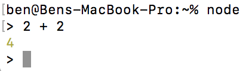

I'm making this repository, since I seem to keep teaching people how to code. This way I can keep common resources in the same place, which will be helpful.

Before We Start
===========
These are things you will need. I will explain them more later, but it's more convenient if I just tell you to get them all right now.

Downloads
-----------
The only thing I'm assuming is the use of a MacOS Mavericks or above (please look up "About this Mac", and make sure you are higher than version OS X 10.9.0 Mavericks) . Also, keep in mind that these are the things I am suggesting to learn Javascript, not to develop in Javascript. These suggestions are based around usefulness vs easy of installation and use.

#### Web Browser
There are a lot of them. To start, please download [Chrome](https://www.google.com/chrome/) if you don't already have it. It has great devtools, and is usually quite standard for web developers to write on.

#### Code Editor
There are a few options here. These are text editors with tools specifically to help make coding easier. I will suggest [Atom](https://atom.io) for now, just because it's free and easy to set up with pretty standard settings. Some other popular ones for website development are Sublime, WebStorm, and Visual Studio Code.

#### Git
How to install (from the [Git website](https://git-scm.com/book/en/v2/Getting-Started-Installing-Git)):

 - Open terminal (Applications > Utilities > Terminal)
 - Type `git --version` and enter
 - If you don’t have it installed already, it will prompt you to install it.
 - Restart the Terminal

#### [NVM](https://github.com/creationix/nvm)
Node Version Manager. This is to help us install Node.js. 

 - Open terminal
 - Paste the command `curl -o- https://raw.githubusercontent.com/creationix/nvm/v0.33.8/install.sh | bash`
 - Restart the Terminal

This runs the installation script to install NVM. 
If you type `nvm`, a huge list of commands should pop up.

#### [Node.js](https://nodejs.org/en/)
Install this with NVM like this: 

 - `nvm install 8.9.0`
 - `nvm use 8.9.0`
 - `nvm alias default 8.9.0`

Now type `node`. A little arrow should pop up on the side. Type 2 + 2. Should look something like this:

Press `ctrl-c` to exit.
We want node so that we can run non-website Javascript on our computer.

Accounts and Bookmarks
-----------
#### [Github](https://github.com)
Please make a Github account. This will let us more easily share code.

#### [MDN Web Docs](https://developer.mozilla.org/en-US/)
This is essentially your dictionary. You'll be referencing this website a lot for what you can do with Javascript and other web technologies.

#### [Codeshare.io](http://codeshare.io)
Don't need any account, just bookmark it. This is basically like a Google Docs for coding, that gives us syntax highlighting. I'll probably send you links to this when we practice things.

#### [coderbyte.com](https://coderbyte.com)
Please make an account here. We'll probably end up doing a lot of the easy and medium challenges on this site.

#### [codecademy.com](https://www.codecademy.com)
Honestly, it's not the greatest, but their basic tutorials do the job at least. You'll need an account for this in order to do their free courses. Please do these courses before we start, and ask me any questions if you get stuck:
 - [Intro to HTML](https://www.codecademy.com/courses/learn-html-elements/lessons/intro-to-html/exercises/intro?action=lesson_resume&course_redirect=learn-html)
 - [Intro to CSS](https://www.codecademy.com/courses/learn-css-selectors-visual-rules/lessons/css-setup-selectors/exercises/intro-to-css?action=lesson_resume&course_redirect=learn-css)
 - [Intro to Making a Website](https://www.codecademy.com/courses/make-a-website/lessons/site-structure/exercises/html-css?action=lesson_resume)
 - [Intro to Javascript](https://www.codecademy.com/courses/learn-javascript-introduction/lessons/introduction-to-javascript/exercises/intro?action=lesson_resume&course_redirect=introduction-to-javascript)
 - [Intro to Command Line](https://www.codecademy.com/courses/learn-the-command-line)

Please do NOT do the other courses besides these. I haven't looked at them before and I'm afraid they might teach you bad habits.

#### [NodeSchool](https://nodeschool.io) is something else we will probably also use.
