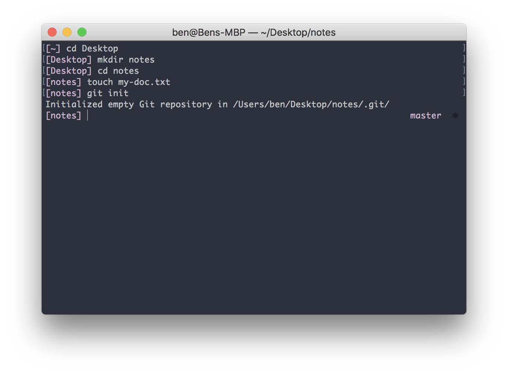
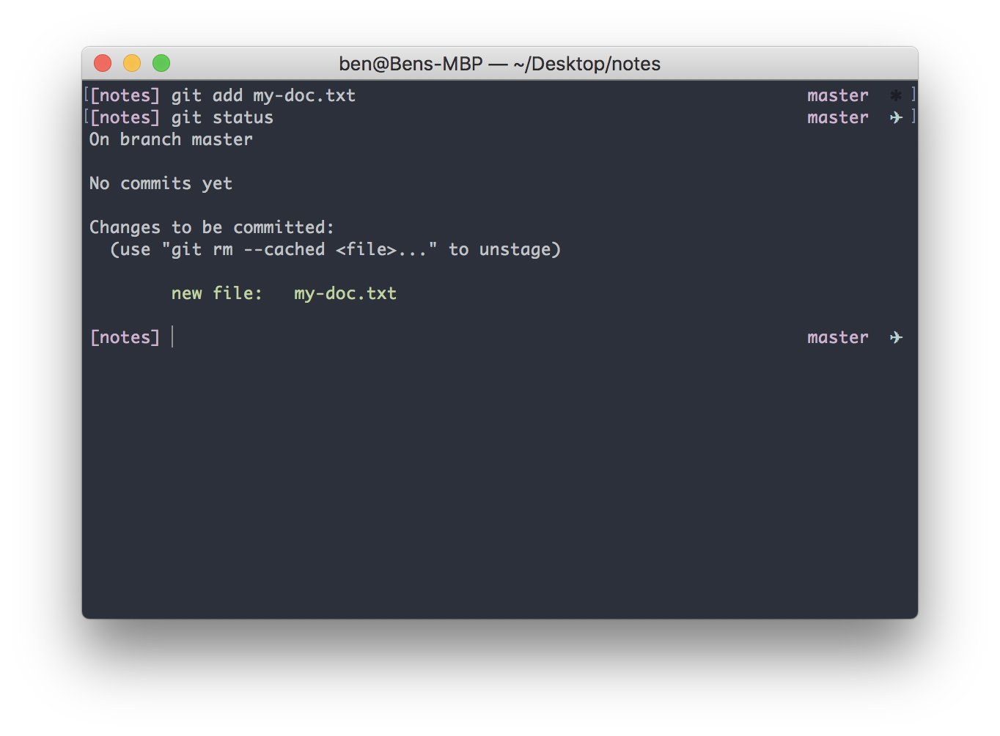
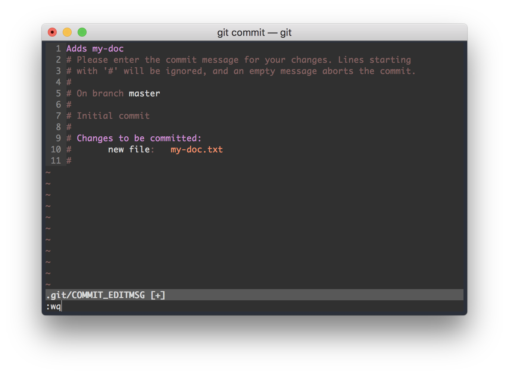
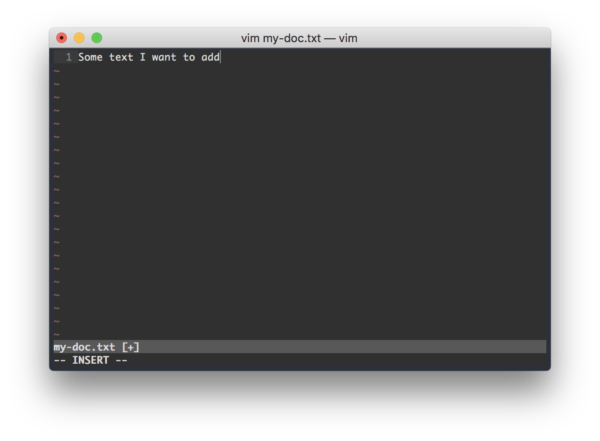
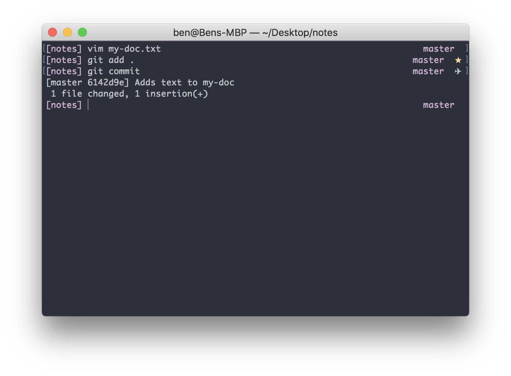
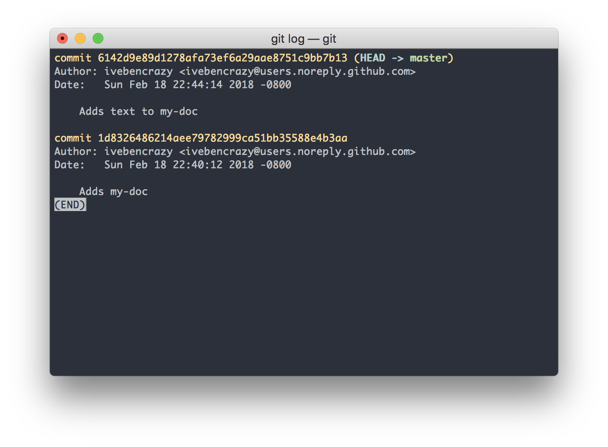
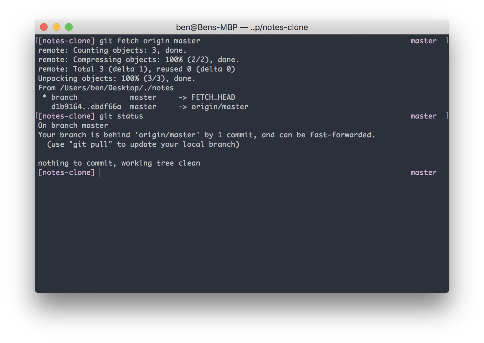
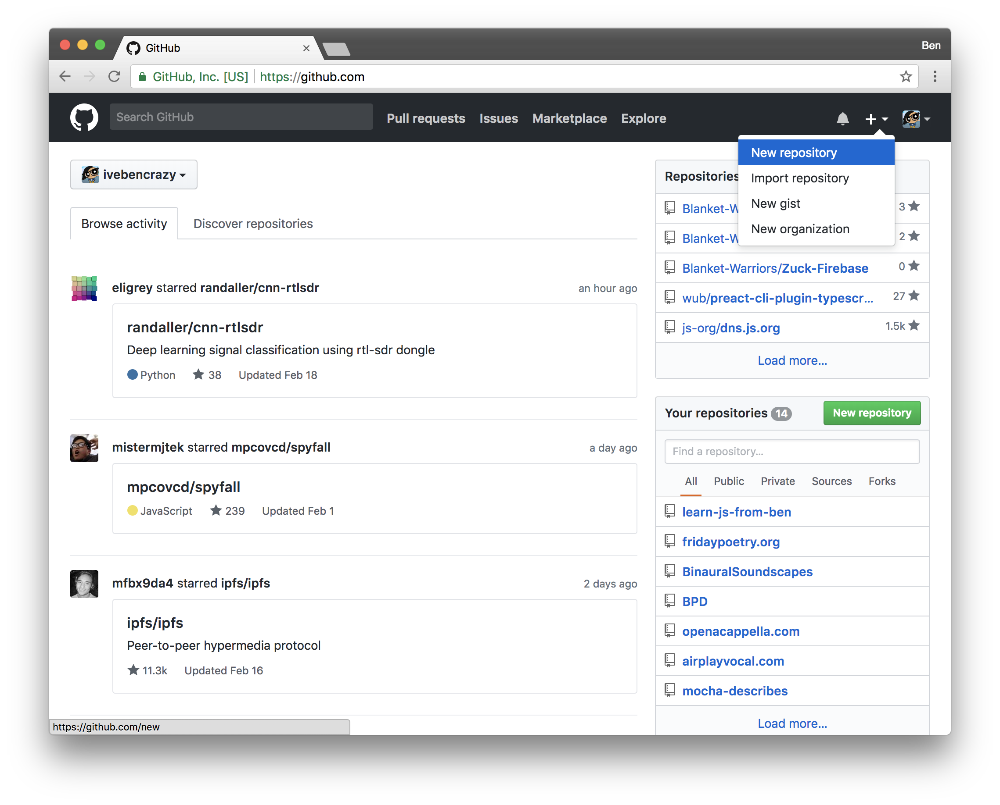

# Lesson 1 - Version Control

**Prerequisites:**

- [Codecademy "Learn the Command Line"](https://www.codecademy.com/learn/learn-the-command-line)
  tutorial lessons 1-2

**In this lesson, we will learn to:**

- Learn about Version Control, and why it's important
- Learn about Git, and how it
- Create a Git repository to keep track of our work
- Start Editing

## What is Git?

As
[explained very well on the Git homepage](https://git-scm.com/book/en/v2/Getting-Started-About-Version-Control),
Git is a distributed version control system. You should seriously read their
introduction page, because it's helpful. In a sentence, Git keeps a history of
changes made to a program, and keeps multiple copies. Why is this so important
that I'm teaching this to you now? In practice, this is especially useful for
collaboration, where it can become difficult to keep track of changes that are
being contributed by multiple people. I like to tell people early, because it
also serves as a good way to keep track of what you're learning and start
showing off your work.

We are going to talk about Git over 2 lessons, started with the idea of version
control. Version control simply means that we keep a history of every version of
a project. Git is very clever at doing this, and allows for the merging of
history. I like to explain what version control systems to by comparing them to
just a shared directory:

  

A shared forlder is great when storing what you want to do, but it falls apart quickly when you have multiple people editing the same file. If three people are editing a file at the same time and upload it back up to our shared folder, each person will be overriding eachother's changes. In the case of something like a Google Doc that's live editing, it would force us to be on the internet and connected all the time, and runs into the issue of conflicting changes all happening at the same time.

  

Git organizes this by having a system to help us merge changes together. We will explore this a bit more in the next lesson, but Git lets each of us make changes to a set of files. We then merge our histories together in order to create the final project. Git tries to be smart about this, automatically merging easy things like unrelated changes in different files, but letting us manually control parts that are more sensitive.

  

**Additional Resources**

- [Git Homepage](https://git-scm.com/about)
- [Git Cheat Sheet (by Bitbucket)](https://www.atlassian.com/git/tutorials/atlassian-git-cheatsheet)
- [Codecademy Git Tutorial](https://www.codecademy.com/learn/learn-git)
